# Petri net modeling of the *Publish-Subscribe* paradigm

This repository contains the plugins to transform services following the *publish-subscribe* paradigm into colored Petri nets. Models are created using Papyrus UML2. Such models are later  annotated with the provided *publish-subscribe* profile.

This repository depends on the [CPN Tools Toolkit](https://github.com/abelgomez/cpntools.toolkit).

## Installing the *Publish-Subscribe Tools*

In Eclipse, go to `Help -> Install New Software...` and use https://abelgomez.github.io/publish-subscribe/updates/ as the URL for the update site.

The *Publish-Subscribe Tools* require [Eclipse Neon](https://eclipse.org/neon/) (4.6) or higher. 

**NOTE:** Although the prototype may be used with newer Eclipse versions, the examples have been developed with [Eclipse Neon](https://eclipse.org/neon/) (4.6). Due to Papyrus limitations, you may experience issues when opening them with a different version.

## Quick Start

Next, we describe how to start using the plugins provided in this repository.

### Create a new project to model a Publish-Subscribe service

To model a service that uses the *publish-subscribe* paradigm, we first need to create a Papyrus project.

To do this, the standard *New* element wizard from Eclipse can be used. Next screenshot shows how to start this wizard from the file menu (`File -> New -> Other...`).

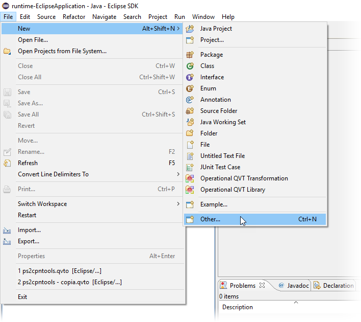

The first screen of the wizard is organized into categories. In the *Papyrus* category, we find the *Papyrus Project* entry.

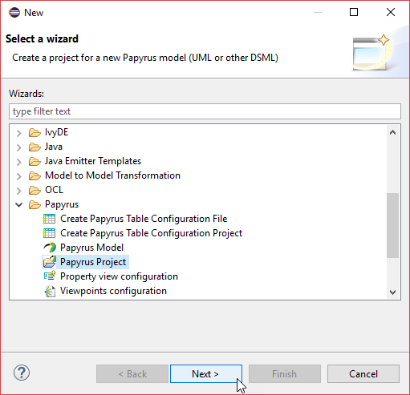

Once the new project wizard has been started, the first thing to configure is the kind of diagram to create. In this case, a *UML* diagram.

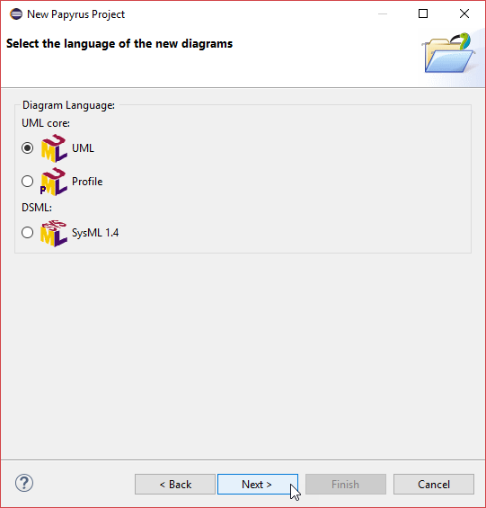

Next, we are asked for the *project name* and the *model file name*.

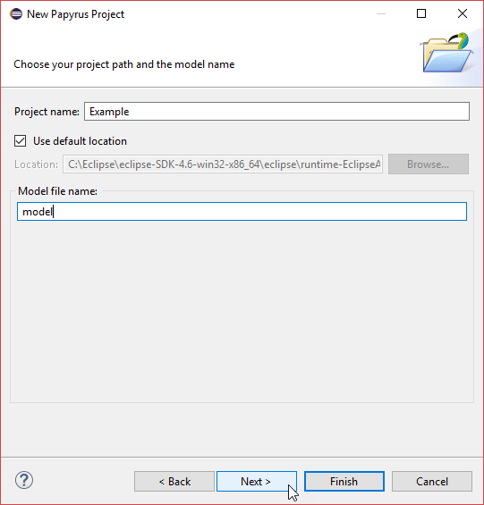

In the next step, first, we define the name of the root element of the new model; second, for the kind of diagram to create (i.e., a sequence diagram); and third, for the profile to be pre-applied to the new diagram.

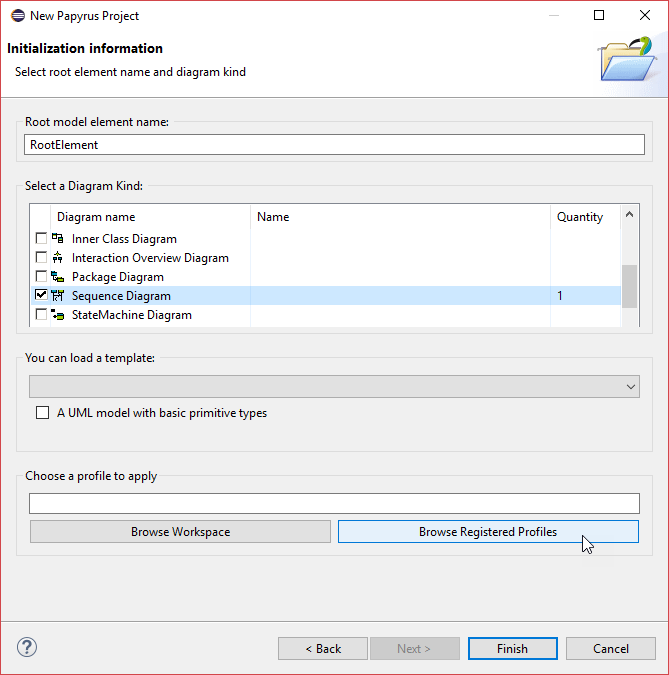

When clicking the *Browse Registered Profiles* button, the profile selection window appears. At this point, we can select the *Publish-subscribe* profile.

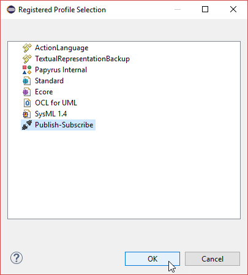

Once the root element name, the diagram kind, and the profile application have been configured, the wizard can be finished.

### Modeling Overview

Next figure shows and overview of the *Papyrus Modeling Perspective*. In the figure, a newly created sequence diagram (to which we have added a new *Lifeline*) is shown. Since the *Publish-Subscribe* profile has been pre-applied, its stereotypes can be directly applied to the model elements.

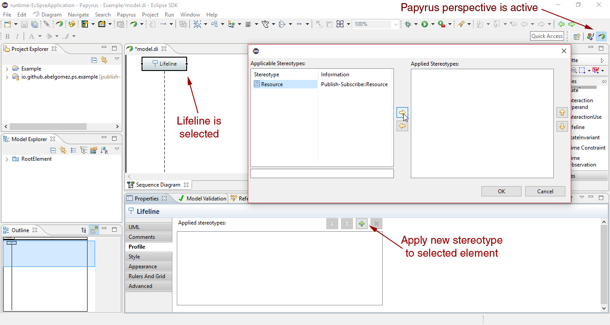

Next, a detail of the properties view is shown. In the figure can be seen how a user can set the tagged values applied to a *Resource*.

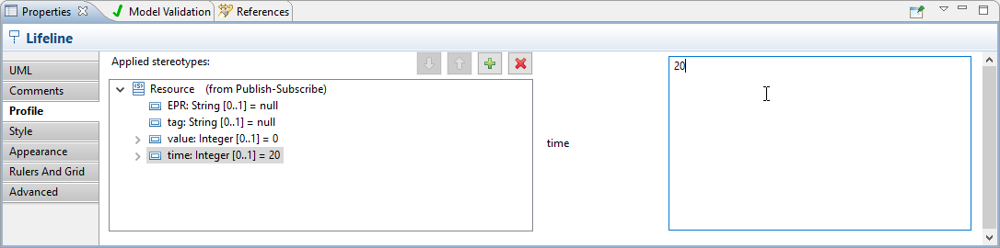

### Generating a CPN Tools Petri net

Once the modeling has been finished, the user can proceed to generate the correponding Petri net. Next screenshot shows that this functionality is provided by means of a pop-up menu.

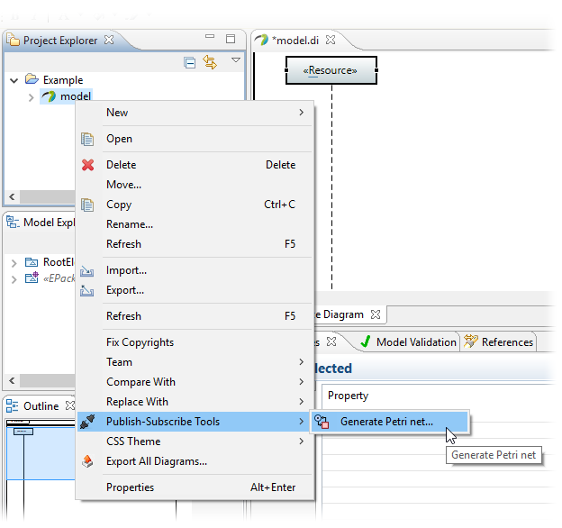

When the generation is invoked from a UML model, the user is asked for the specific interaction he/she wants to transform.

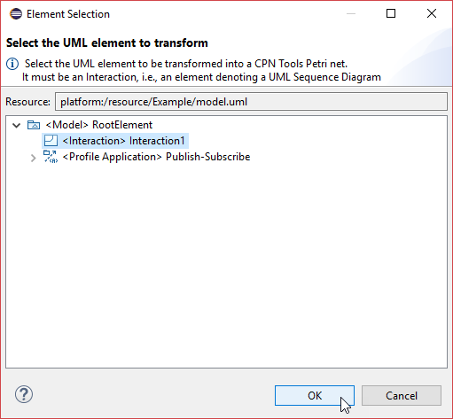

Once the generation has finished, a new file with the same name than the UML model file (but with the `cpn` extension) is placed into the workspace next to the source file. This file can be directly opened with CPN Tools if it is installed in the system.

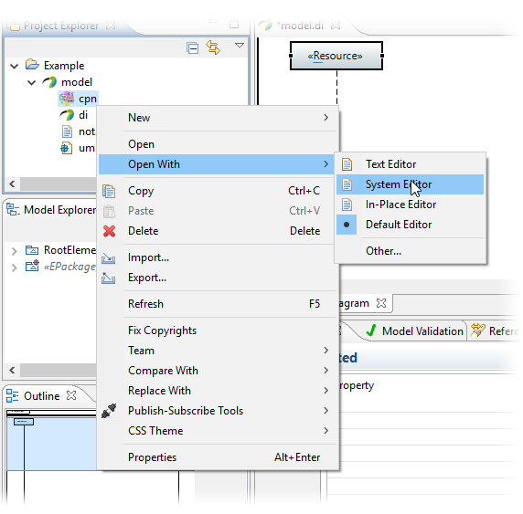

Next screenshot shows what an auntomatically generated Petri net looks like in CPN tools.

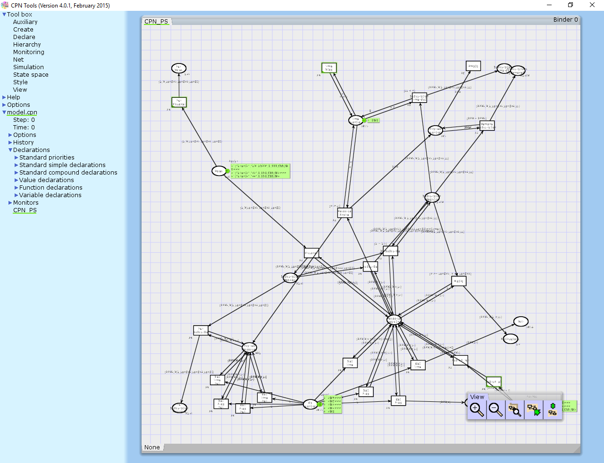

### Customizing the QVTo transformation

The QVTo transformation included within the prototype can be customized at runtime. This can be done from the Eclipse's preferences. Next figure shows how to open the Eclipse's preferences window.

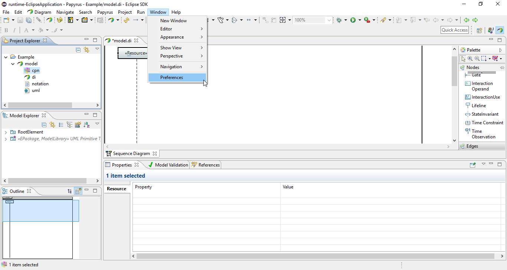

The location of the file containing specific transformation to be executed can be customized from the preference page located in `Publish-Subscribe Tools -> Transformation`. This allows having different transformations that can be switched at run time.

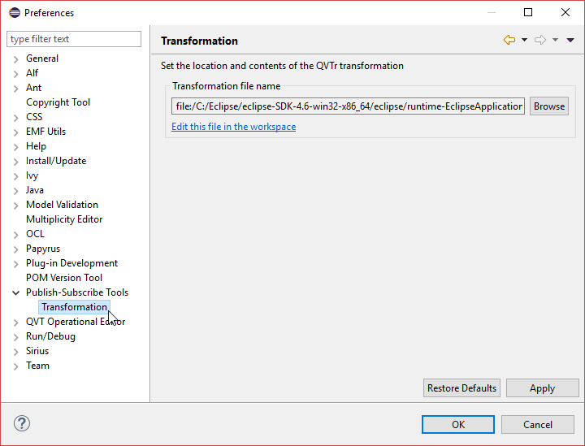

In addition, by using the *Edit this file in the workspace* link, the file is opened into the Eclipse platform with the default QVTo editor. Changes done in this editor are directly reflected in the transformation, which allows direclty customizing the QVT transformation easily without rebuilding the plug-ins.

Next image shows what the IDE looks like when the file is opened in the workbench. Once the file has been opened, the preferences window can be closed to proceed with the editing.

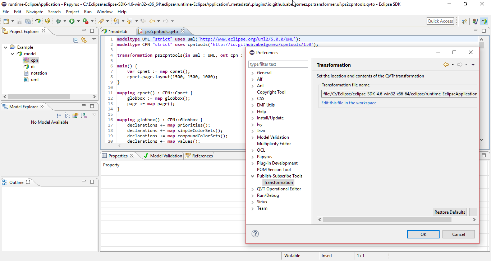

## Repository contents

### Plug-in Projects

#### [io.github.abelgomez.ps.example](plugins/io.github.abelgomez.ps.example)

Simple plug-in containing some example models.

#### [io.github.abelgomez.ps.profile](plugins/io.github.abelgomez.ps.profile)

Plug-in containing the profile to annotate UML models of services following the publish-subscribe pattern.

#### [io.github.abelgomez.ps.transformer](plugins/io.github.abelgomez.ps.transformer)

M2M transformation from the UML2 metamodel (+ publish-subscribe annotations) to the CPN Tools metamodel.

#### [io.github.abelgomez.ps.transformer.test](plugins/io.github.abelgomez.ps.transformer.test)

Test plug-in containing some sample code demonstrating how the transformation is invoked.

#### [io.github.abelgomez.ps.transformer.ui](plugins/io.github.abelgomez.ps.transformer.ui)

Plug-in containing the UI contributions, i.e., preference pages, pop-up menus and dialogs.

### Feature Projects

#### [io.github.abelgomez.ps.feature](features/io.github.abelgomez.ps.feature)

Feature for the Publish-Subscribe profile and associated transformations. Included plugins are:

* io.github.abelgomez.ps.profile
* io.github.abelgomez.ps.transformer

#### [io.github.abelgomez.ps.ui.feature](features/io.github.abelgomez.ps.ui.feature)

Feature for the UI contributions. Included plugins are:

* io.github.abelgomez.ps.ui

#### [io.github.abelgomez.ps.sdk.feature](features/io.github.abelgomez.ps.sdk.feature)

Feature for the SDK. Includes all the previous features, together with the CPN Tools Toolkit SDK, QVTo SDK and Papyrus SDK. Additional included plugins are:

* io.github.abelgomez.ps.transformer.test
