# From UML Models to CPN

In the following, we detail the transformation of the UML models annotated with the profile into TCPN. We first describe the UML parts, annotated with the profile, and then how the transformation is carried out for each part. 

### PS Core Net

[Figure 1](#ps_core_cpn) illustrates the TCPN of the PS core net model. This core net rules the resource publication, resource subscription, notifications, and resource expiration. The PS core net model generated by our model transformation is (slightly) simplified with regard to the previous model introduced in  [https://link.springer.com/chapter/10.1007/978-3-319-19458-5_6](https://link.springer.com/chapter/10.1007/978-3-319-19458-5_6). This modification was needed to cope with all automatic transformation contributed in this paper an later explained for the following stereotypes. A single core net is generated for each UML sequence diagram stereotyped as `PublishSubscribeScenario`. `PublishSubscribeScenario`s should include the initialization of resources, the subscription messages of the different clients, and the additional interactions which are triggered when notifications are sent. In the core net, the initial marking of the *Roles* and *Resources* places -- which are explained below -- are the only variable parts. 

In this TCPN, the resources to be published are represented by tokens on the *Resources* place, which contain their *EPR*, *tag*, *value* and *lifetime*. Resources are then published by firing the *Publish_ok* transition, but if we try to publish a resource with an existing *EPR*, this operation fails (by firing *publish_fail*). Published resources are written to the *ResourceRegistry* place. Clients' behaviors are represented by tokens on place *Roles*, where we indicate a client's identifier, a resource tag and the subscription conditions for the indicated resource. The *Discover* transition is then fired to find published resources and write the corresponding subscription conditions into the *SubscriptionRequest* place. The *Subscribe* transition is then fired to submit the subscriptions, which are written on the *SubscriptionRegistry* place. 

When the lifetime of a resource expires, the *ResourceExpire* transition is fired, which removes the resource token from *ResourceRegistry*, as well as its current subscriptions (transition *RemoveSubscription*). Furthermore, subscriptions can also expire. In that case, the *SubscriptionTime-Out* transition will be fired, thus removing the corresponding token from *SubscriptionRegistry*. Finally, notifications occur as soon as the associated conditions hold, which is captured by transition *Notify*, which has the greatest priority (P1). 

**Figure 1. Timed Colored Petri net of the PS core model**

### Publish-Subscribe Scenarios

[Figure 2](#ps_scenario) (a, right-side) shows a UML-SD stereotyped as a `PublishSubscribeScenario`. In addition to the fixed core net presented above, an additional variable net describing the subscription interactions is generated. As it can be observed, a `PublishSubscribeScenario` SD should be accompanied by a DD describing the allocation of `Services` and `Resources`. Specifically, [Figure 2](#ps_scenario) (a, left-side) shows a UML-DD where a node (*Service1*) and an artifact (*Resource1*) within the node are annotated with Service and Resource stereotypes, respectively. The association between resources and services is directly taken from the node-artifact relationship. 

[Figure 2](#ps_scenario) (b, right-side) shows the basic net generated from a UML-SD *Subscription* stereotyped with *PublishSubscribeScenario*. A UML-SD will generate at least one place (*Start Subscription* place) and two transitions. Between these transitions, the subnet resulting from all the interactions described in the UML-SD lifelines will take place. This internal subnet is built in a compositional way, by applying the rest of the patterns explained in this Section in the order they occur, and which are connected among them by basic places whose color is `UNIT`. 

Additionally, every Client and Resource lifelines have an associated place which is used to avoid race conditions issues when handling client/resources attributes. It is noteworthy to mention that greyed places represent *fusioned* places, i.e., places that act as a single one although they are drawn multiple times in different parts of the CPN. The *Acquire Locks* and *End Subscription* transitions represent the beginning and the ending of the UML-SD. In particular, the first transition also has as input places the client/resource lock places that represent the client/resources involved into the UML-SD. Similarly, the ending transition has as output places the same client/resource lock places, ensuring the conservativeness of the tokens (i.e., the acquired locks are eventually released). 

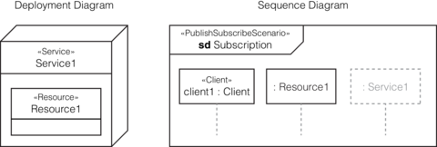

(a) UML annotated

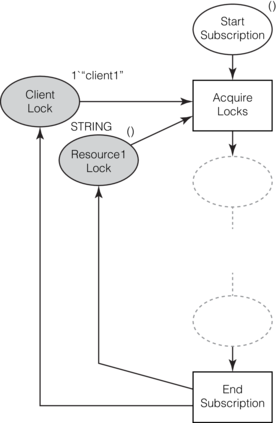

(b) CPN generated

**Figure 2. Transformations of Resource and Service stereotypes**

### Clients

In addition to UML-DD, UML-CD are also used to provide the static view of the system to be analyzed. [Figure 3](#client) (a, left-side) shows an example of this, depicting a *Client* class with attributes *att1, att2, ... attn* of data types *DataType1, DataType2, ... DataTypen*, respectively. Clients are marked as such, using the `Client` stereotype in UML-SD, as shown in [Figure 3](#client) (a, right-side). 

[Figure 3](#client) (b, left-side) shows the transformation of UML depicted in [Figure 3](#client) (a, left-side). Note that the *Client* class is directly transformed to a timed product color set. The first component is a single string used to unequivocally identify every instance of the class, i.e., to identify the class objects. The rest of the components are each of the class attributes. For the sake of simplicity, our transformation algorithm also defines a set of variables following the attributes defined within the class (e.g., "var att1: DATATYPE1", "var att2: DATATYPE2", etc.). The existence of a lifeline in a UML-SD stereotyped as Client is straightforwardly transformed to a colored place having the previously mentioned timed product color set as color set and an initial token with the values of object *Client1*. As it can be seen, the place is represented in grey, denoting that this place will be (re-)used in several places in forthcoming patterns whenever a *client* appears. 

(a) UML annotated

(b) CPN generated

**Figure 3. Transformation of Client stereotype**

### Subscriptions

Once the basic elements have been transformed (core net, client definitions, and external structure of the *Subscription* PN), let us explain subscription interactions starting by the Subscription stereotype. Consider a *Resource1* having *(1, 'R1', v1, t1)* as attribute values and a *Client1* who subscribes to such a resource by means of a Subscription stereotyped message, as depicted in [Figure 4](#subscription) (a). Note that *Client1* subscribes for a time frame *st1*, triggering the UML-SD named *triggeredSD* once the values of *Resource1* are in the interval of *[min1, max1]*. *triggeredSD*s will be covered later. 

Both Resource and Subscription stereotypes are transformed to initial colored tokens in the PS core CPN -- the only variable part of the core net, as explained above. In particular, Resource stereotype serves to populate the *Resources* place. As shown in [Figure 4](#subscription) (b), attribute values of Resource in *Resource1* generates a colored token *(1, 'R1', v1, t1)* in *Resources* place. Similarly, the Subscription stereotyped message serves to populate the *Roles* place. 

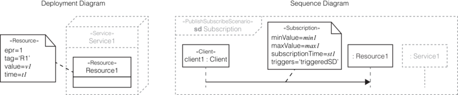

(a) UML annotated

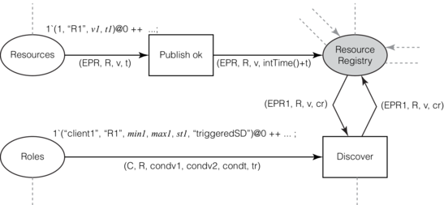

(b) CPN generated

**Figure 4. Transformation of Subscription stereotypes**

### Initialization/Modification of Clients Attributes

The AssignmentExecution stereotype is used in a UML-SD stereotyped with PublishSubscribeScenario to indicate when the attributes of a *Client* object are modified, as depicted in [Figure 5](#assignment)(a). Our transformation tool automatically verifies the correctness of the model, i.e., it checks whether every property specified in each AssignmentOperation matches to some attribute of the *Client* class. Any datatype error in the specified values is indicated by the CPN tool, indicating a mismatch datatype error in the corresponding arc inscription. 

Let us describe how this transformation is carried out. First, every execution specification in the UML-SD generates a branch in the sequential Colored Petri net that represents the execution of the overall UML-SD. Then, each execution specification annotated with AssignmentExecution generates a transition for each of the AssignmentOperation attributes. This transition is connected to the place in which the current status (values) of the object *Client* is stored. Let *atti* be the attribute which receives a value *vali*. As input arc, it receives a tuple conformed by *(client1, att1, att2,..., atti, ..., attn)*, which represents the particular instance of *Client* that plays in the UML-SD. As output arc, it returns a colored token conformed by *(client1, att1, att2, ..., vali, ..., attn)*. Note that the only value that changes in the output token with respect to input one is the value of attribute *atti*. [Figure 5](#assignment) (b) depicts an example of this transformation process when *att1* and *att2* attributes are modified. Note that since this action occurs inside a PublishSubscribeScenario UML-SD, the *Client* lock was acquired at the beginning and hence no race conditions arise. 

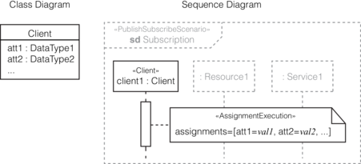

(a) UML annotated

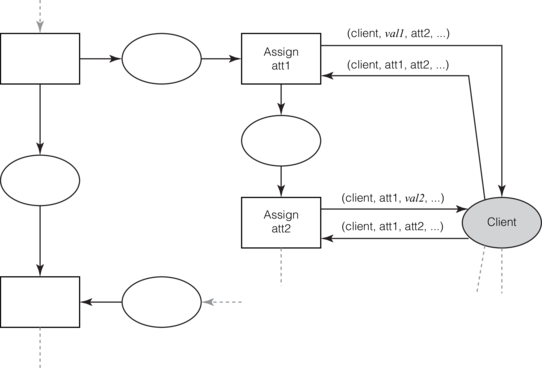

(b) CPN generated

**Figure 5. Transformation of AssignmentExecution stereotype**

### Initialization/Modification of Resources Values

Values of *Resources* can only be modified either by their owning *Service* during a *subscription* interaction, or by an operation performed by a given *Client* on a *triggered SD*. TimedSetter is the stereoptype used for the former case (for the latter, see below). 

[Figure 6](#timed_setter) shows the transformation of this TimedSetter stereotype Let us consider a *Resource* node stereotyped with *R1*, which eventually receives a timed setter message -- i.e, stereotyped with TimedSetter stereotype -- from its service owner, as shown in [Figure 6](#timed_setter) (a). This message is used to update the value *val* of a *Resource* as indicated by the *operator* attribute during a given *lifetime* *t*. The generated subnet contains two places and one transition, being the transition also connected to the *Resource Registry* place. The output arc of the transition has a colored token as inscription with the new value of the registry. Note that the value takes into account the operation *op* to perform and the value *val* specified as stereotype attribute values. For instance, let us consider that *operation=(operator=mult, value=3)*. Hence, the arc inscription of this operation becomes *(EPR, 'R1', v · 3, t)*. 

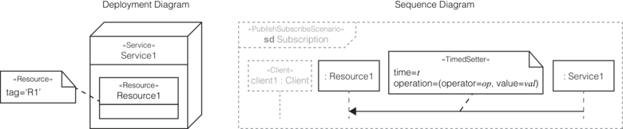

(a) UML annotated

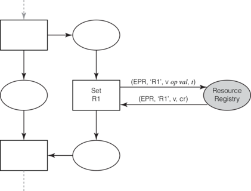

(b) CPN generated

**Figure 6. Transformation of TimedSetter stereotype**

### Delaying Messages

The transformation of the Delayed stereotype -- which is used to specify a delay on a given message -- follows a similar scheme to TimedSetter stereotype. [Figure 8](#delayed) shows the transformation pattern, which will be inserted before any other pattern produced by the message to insert such a delay. Let us consider a *Resource* node stereotyped with *R1* which eventually receives some message from its service owner, stereotyped with Delayed, as shown in [Figure 8](#delayed) (a). In this case, a pair of places and a transition connected to those places are generated, as shown in [Figure 8](#delayed) (b). These new places are connected to the sequential CPN representing the evolution of the UML-SD. The transition has also an input/output arc from/to the *Resource Registry* place. Recall that the *Resource Registry* place keeps track of all resources in the system and their current values. The value of the Delayed::delay attribute is the time that the new transition takes to fire. 

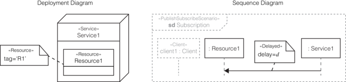

(a) UML annotated

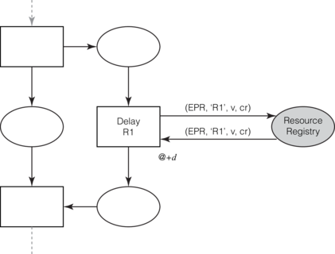

(b) CPN generated

**Figure 7. Transformation of Delayed stereotype**

### Triggered Sequence Diagrams
  
As mentioned above, *triggered sequence diagrams* (*triggeredSDs*) are those UML-SD describing the interactions happening when the *value* of a *Resource* is between the minimum and maximum values specified by a subscribed *Client*. [Figure 9](#triggered_sd) shows the transformation of a triggered UML-SD to TCPN. The CPN pattern is similar to the aforementioned transformation of Subscription stereotype, with an important exception: the *Acquire Locks* transition is also connected to the *Notifications* place. Notice the grey color, which means that *Notifications* is the same *Notifications_0* place shown in the center of the core net. As shown, the UML-SD is transformed to a place *Start triggeredSD*, in which a token will be set indicating the starting of the UML-SD, and two transitions. The initial transition, *Acquire Locks*, has as input places *Start triggeredSD*, all places that represent the client and resource locks of the corresponding client and resources which interact in the UML-SD, and the *Notifications* place. Note the arc inscription between the latter and *Acquire Locks*, since it controls that only the transition on the right net is fired. 

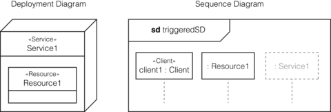

(a) UML annotated

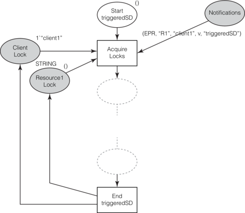

(b) CPN generated

**Figure 8. Transformation of triggered UML-SD**

### Reading Resources Values

The transformation of the Getter stereotype depends on the messages that follow after a stereotyped message. To avoid confusion, first, we introduce the transformation of Getter stereotype in its generic form. Other uses of `Getter` will be progressively explained as other patterns relying on it appear in the text. 

[Figure 9](#getter) illustrates the transformation of the Getter stereotype. As depicted in [Figure 9](#getter) (a), consider the message sent between *client1* and *Resource1* stereotyped with Getter, having as attribute value "var". This is transformed as shown in [Figure 9](#getter) (b): a transition with incoming/output arc from/to the *Resource Registry* place, having as inscription the tag value of *Resource1* and the attribute value "var". 
  

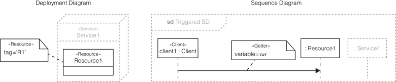

(a) UML annotated

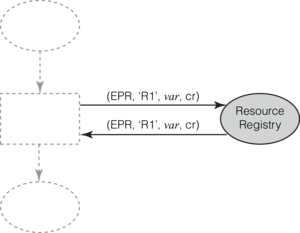

(b) CPN generated

**Figure 9. Transformation of Getter stereotype**

### Updating Resources Values

As aforementioned, values of *Resources* can only be modified either by their owning *Service* during a *subscription* interaction, or by an operation performed by a given *Client* on a *triggered SD*. Setter is the stereoptype used for the latter case. A Setter stereotype is transformed as illustrated in [Figure 10](#setter). 

The UML-SD in [Figure 10](#setter) (a) shows a message being sent between *client1* and *Resource1*, which is stereotyped with Setter. This message aims at changing the resource value as indicated by the attribute parameters. The corresponding TCPN is depicted in [Figure 10](#setter) (b): the stereotype is transformed to a transition and an incoming/output arc from/to the *Resource Registry* place. The inscription of the incoming arc ensures that *Resource1*, whose tag value is "R1", is taken from the *Resource Registry* place. As inscription of the output arc, the value "v" of the resource is modified as indicated by the attribute values of the Setter message.

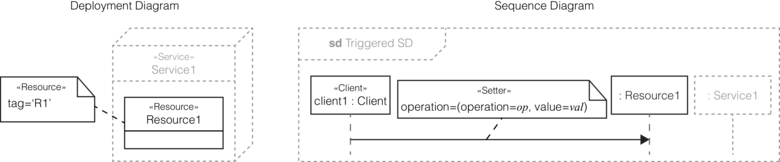

(a) UML annotated

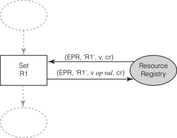

(b) CPN generated

**Figure 10. Transformation of Setter stereotype**

### Updating Resources using Getted Values

When a message stereotyped with Setter follows a message stereotyped with Getter, being the attribute value of Getter stereotype used in the attribute values of Setter, the transformation is carried out as depicted in [Figure 11](#getter_setter). Note that the transformation is equivalent to the fusion of both transformations of Setter and Getter stereotypes. 

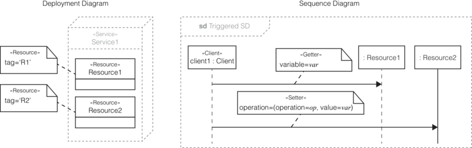

(a) UML annotated

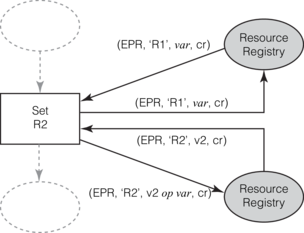

(b) CPN generated

**Figure 11. Transformation of combination of Getter and Setter stereotypes**

### Parallel Execution

Combined fragments are structural components from UML whose transformation is not directly linked to any stereotype of the UML profile. First, we describe the transformation of UML-SD parallel combined fragments and then the transformation of UML-SD of alternative combined fragments. 

Consider a UML-SD with a parallel combined fragment as depicted in [Figure 12](#parallel_fragments) (a). The transformation is as follows. First, a branch is created in the sequential Petri net that represents the execution of the overall UML-SD creating places *PStart, PEnd* and transitions *ParInit, ParEnd*. Then, each of the fragments in the parallel fragment is individually transformed to CPN following the rest of the patterns explained in this Section. Note that *ParInit* and *ParEnd* act as fork-join transitions. 

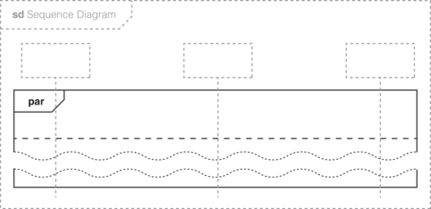

(a) UML annotated

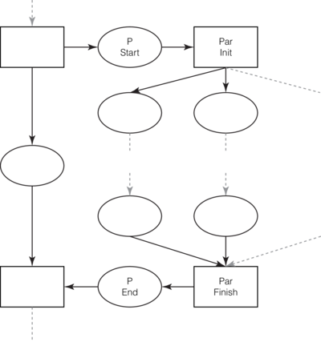

(b) CPN generated

**Figure 12. Transformation of parallel combined fragments into TCPN**

### Alternative Execution

Consider now a UML-SD with an alternative combined fragment as depicted in [Figure 13](#alt_fragments) (a). The transformation is similar to previous one. First, a branch is created in the sequential Petri net that represents the execution of the overall UML-SD creating two auxiliary places and two transitions, plus two additional places *Alt Init*, and *Alt Finish*. Every condition in the fragment creates a branch from the place *Alt Init* to *Alt Finish*. Furthermore, every transition that starts a branch is set with a guard expressing the corresponding condition indicated in the alternative combined fragment. Last, for every condition in the alternative combined fragment, its corresponding transition is set to a higher priority than the default condition. Hence, the default case of the alternative combined fragment has the lowest priority. Then, each of the fragments in the alternative fragment is individually transformed to CPN following all the other patterns explained in this Section. 

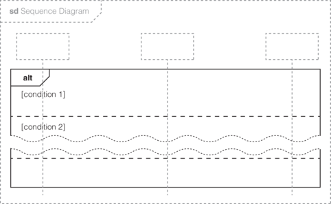

(a) UML annotated

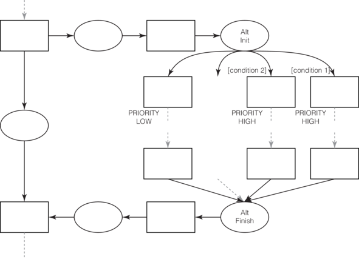

(b) CPN generated

**Figure 13. Transformation of alternative combined fragments into TCPN**

### Alternative Execution Based on Getted Values

Let us consider now a message stereotyped with Getter, having as attribute value "var", and an alternative combined fragment such that the execution of the combined fragments depends on an expression containing "var" in its terms. In this case, the model transformation is as follows. The alternative combined fragment creates two places, *Alt Init* and *Alt Finish*. The former place is connected as output place to a transition following the sequence execution of the UML-SD, and the latter place is connected as input place to another transition, from which the execution of the UML-SD would continue. Two sequences of places and transitions, as shown in [Figure 14](#getter_alt) (b), are generated to represent the actions in each of the alternative combined fragments. The transition starting the execution of actions in the combined fragment that evaluates the expression containing "var" follows the generic model transformation of the Getter stereotype shown in [Figure 9](#getter). Furthermore, this transition is set with a higher priority than the other alternative path, thus ensuring that this transition is first evaluated and fired instead of the other, depending on the value of the expression. 

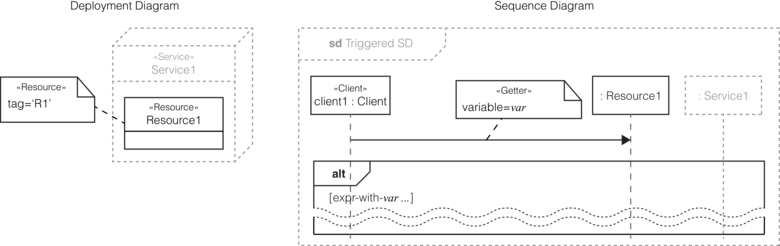

(a) UML annotated

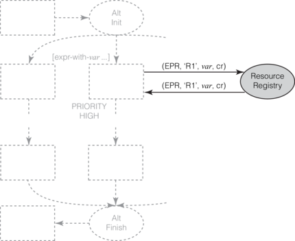

(b) CPN generated

**Figure 14. Transformation of combination of Getter and an alternative combined fragment**

